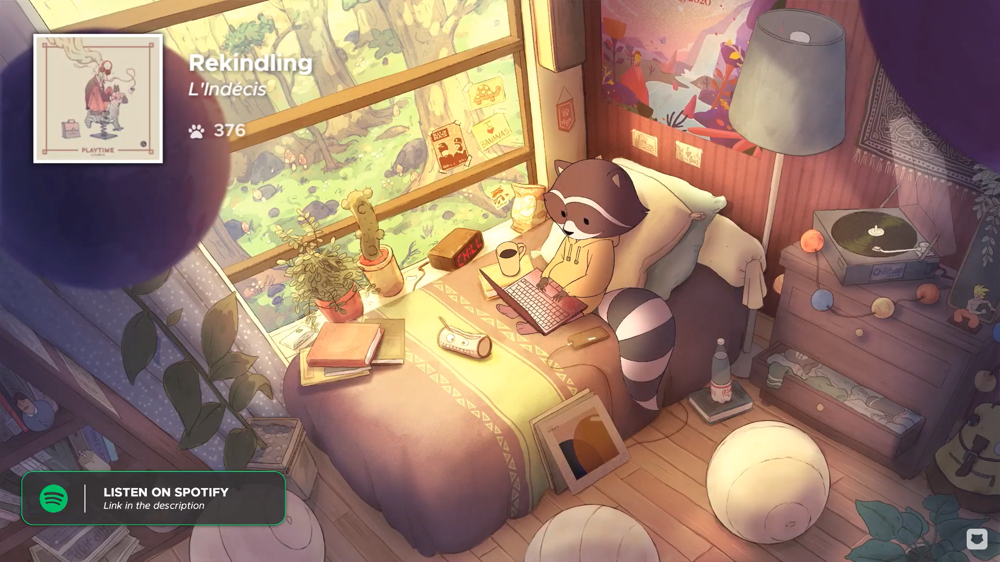

# chill-o-clock

Chill-o-clock is a project full of nice, warm, and cozy intentions. It was developed during "The Great Pause of 2020", when the world population fell under times of stress and longing.

This clock was inspired by a [Youtube video music live stream by Chillhop Music](https://www.youtube.com/watch?v=7NOSDKb0HlU). It is a 24/7 music stream of relaxing lofi hip hop music. In it, we find a raccoon doing what most of us did during this period of recession and isolation: working from home. What inspired this project from that video is a small clock resting by the windowsill, whith the word "chill" spelled out in a 7-segment display.
<!--  -->

## Components:

## Installation:
