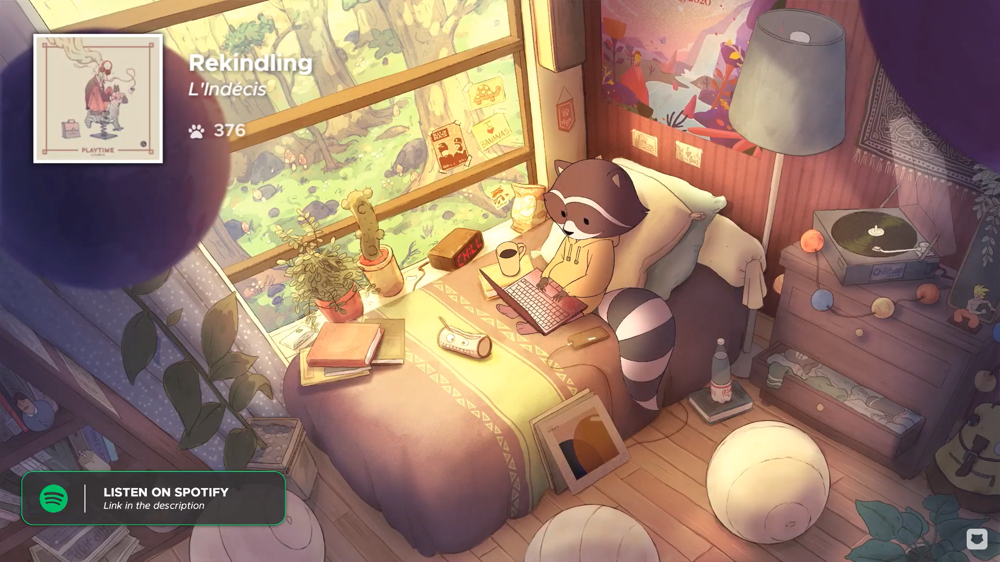

# chill-o-clock

Chill-o-clock is a project full of nice, warm, and cozy intentions. It was developed during "The Great Pause of 2020", when the world population fell under times of stress and longing.

This clock was inspired by a [Youtube video music live stream by Chillhop Music](https://www.youtube.com/watch?v=7NOSDKb0HlU). It is a 24/7 music stream of relaxing lofi hip hop music. In it, we find a raccoon doing what most of us did during this period of recession and isolation: working from home. What inspired this project from that video is a small clock resting by the windowsill, whith the word "chill" spelled out in a 7-segment display.
<!--  -->

## What is this all about?
Chill-o-clock looks like a standard clock, except it doesn't really tell time! By default, it displays CHILL on the screen. However, it connects to your local WiFi network and can be controlled via Alexa.
The only configuration it needs is your WiFi credentials, which are managed from a smartphone or another device. It acquires the local time automatically through an NTP client.
It can be set up from the Alexa app to follow routines. An example scenario: The clock is displaying the time (like all clocks should), and you issue the command "Alexa, chill". Your clock then displays CHILL on the screen instead, starts playing some mellow lofi jazz and dims your bedroom lights to a custom scene. Too good to be true? 

## Components:

#### 1: Wemos D1 mini

The [wemos D1 mini](https://docs.wemos.cc/en/latest/d1/d1_mini.html) is an inexpensive development board, based on the ESP8266 microcontroller. 

#### 2: Robotdyn 7-segment Display Module

The [Robotdyn 7-segment display module](https://www.tinytronics.nl/shop/nl/verlichting/led-segment-display/robotdyn-segmenten-display-module-4-karakters-klok-wit-tm1637) is a ready-to-use segment display that is controlled by a TM1637 LED Driver.

#### 3: 3D printed case

A case was designed in OnShape to contain all the elements in a simple and streamlined design. An STL file is provided in the repository, but the source files can be also accessed [here](https://cad.onshape.com/documents/08340cc6f29862dcc528953b/w/b77ac7df4f203161906391dc/e/95ec5e5d9ebae1b337644027)

## Installation:

#### 1: Arduino IDE

Download the [Arduino IDE](https://www.arduino.cc/en/Main/Software) and install the following libraries:
- NTP client by Fabrice Weinberg
- Spacebrew Yun by Julio Terra
- Arduino JSON by Benoit Blanchon
- IoTWebConf by Balazs Kelemen
- SinricPro by Boris Jaeger
- TM1637 by Avishay Orpaz
- WebSockets by Markus Sattler
- WiFi Manager by tzapu, tablatronix

#### 2: Sinric Pro

[Sinric Pro](https://sinric.pro/index.html) offers a simple way to control your IOT development boards like RaspberryPi, ESP8226, ESP32 or Arduino with Amazon Alexa or Google Home.

- Create an account and access the [device portal](https://portal.sinric.pro/device/list)
- Create a new device (Add Device)
    - Give it any name
    - As Device Type, select Smart Light Bulb
    - Replace the LIGHT_ID in the source code for yours
    - Under "Credentials", create a new App Key and secret. Replace APP_KEY and APP_SECRET in the source code for yours

#### 4: Connecting chill-o-clock to your WiFi

When you plug in the device, nothing will show on the screen. That's ok! On your phone or other device, go to your WiFi manager. You should be able to find a network called "chill-o-clock". When you connect, you'll be taken to a screen where you can configure the WiFi credentials on the chill-o-clock. Select your SSID from the menu and type in your password. Your device will automatically disconnect, and your clock will be ready to use!

#### 3: Alexa

In order to control the clock via voice commands, install the Sinric Pro Skill on your Alexa device. In the setup you can log in with your Sinric Pro account and discover and configure your device.

You can create Automations that control your Chill-o-clock.

The chill-o-clock accepts the following commands:
- On/Off: The device will display CHILL when turned on, and will display the local time when switched off. (e.g. "Alexa, turn chill on" will set the clock to display CHILL)
- Brightness: The device brightness can be set to values between 0 and 100. (e.g. "Alexa, set chill brightness to 50 percent"). Try setting it to 42 for a little surprise! ;)
