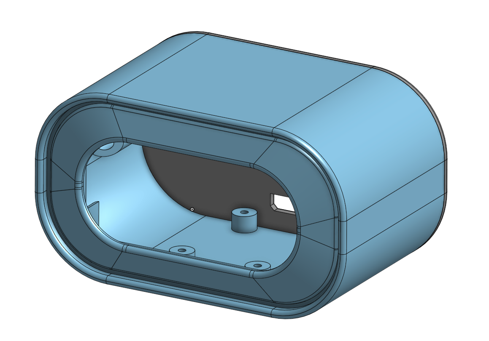

# chill-o-clock

Chill-o-clock is a project full of nice, warm, and cozy intentions. It was developed during "The Great Pause of 2020", when the world population fell under times of stress and longing.

This clock was inspired by a [Youtube video music live stream by Chillhop Music](https://www.youtube.com/watch?v=7NOSDKb0HlU). It is a 24/7 music stream of relaxing lofi hip hop music. In it, we find a raccoon doing what most of us did during this period of recession and isolation: working from home. What inspired this project from that video is a small clock resting by the windowsill, whith the word "chill" spelled out in a 7-segment display.
<!--  -->

## Components:

#### 1: Wemos D1 mini

The [wemos D1 mini](https://docs.wemos.cc/en/latest/d1/d1_mini.html) is an inexpensive development board, based on the ESP8266 microcontroller. 

#### 2: Robotdyn 7-segment Display Module

The [Robotdyn 7-segment display module](https://www.tinytronics.nl/shop/nl/verlichting/led-segment-display/robotdyn-segmenten-display-module-4-karakters-klok-wit-tm1637) is a ready-to-use segment display that is controlled by a TM1637 LED Driver.

#### 3: 3D printed case

A case was designed in OnShape to contain all the elements in a simple and streamlined design. An STL file is provided in the repository, but the source files can be also accessed [here](https://cad.onshape.com/documents/08340cc6f29862dcc528953b/w/b77ac7df4f203161906391dc/e/95ec5e5d9ebae1b337644027)

## Installation:
